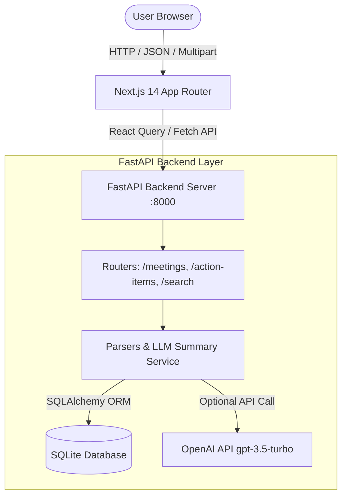
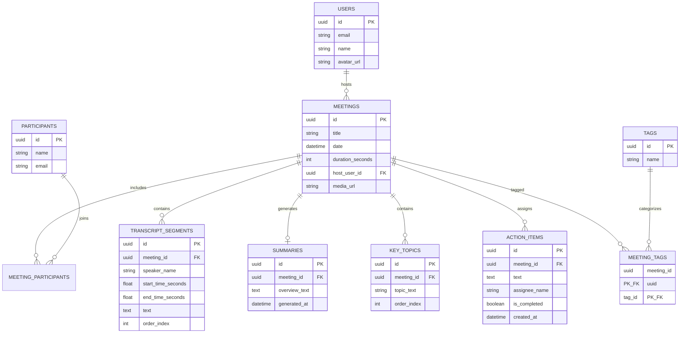

# Meeting Intelligence Platform (Fireflies.ai Fullstack Clone)

An end-to-end, production-grade meeting assistant and conversation intelligence platform built with **Next.js 14 (App Router)**, **FastAPI**, **SQLAlchemy ORM**, **SQLite**, and **Tailwind CSS v4**.

Designed to mirror the core meeting-assistant user workflows of [Fireflies.ai](https://fireflies.ai), this platform ingests multi-speaker meeting transcripts, generates AI summaries and key topics, manages action items with real-time optimistic sync, and provides a synchronized interactive transcript player with in-transcript and global `Cmd+K` command-palette search.

---

## 🌐 Live Production Deployment & Architecture

- **Live Frontend Application (Vercel):** `https://meeting-intelligence-platform.vercel.app` *(Placeholder — replace with live Vercel URL)*
- **Live Backend API (Render):** `https://meeting-intelligence-platform.onrender.com/api/v1` *(Placeholder — replace with live Render URL)*
- **Interactive OpenAPI Documentation:** `https://meeting-intelligence-platform.onrender.com/docs` (Swagger UI)

### 🏗️ Production Infrastructure Design

```
┌─────────────────────────┐               ┌─────────────────────────────────────────┐
│     Frontend Web        │               │           Backend Web Service           │
│    Vercel Edge Network  │ ────────────> │                 Render                  │
│    (Next.js 14 App Router)              │      (FastAPI + Uvicorn ASGI Server)     │
└─────────────────────────┘               └────────────────────┬────────────────────┘
                                                               │
                                                               ▼
                                                  ┌─────────────────────────┐
                                                  │     Persistent Disk     │
                                                  │       Mounted @ /data   │
                                                  │     (SQLite /data/app.db)│
                                                  └─────────────────────────┘
```

#### Render Free Tier SQLite Architecture
Render Free Tier instances run on ephemeral container filesystems where persistent disk attachments require paid tiers. To support 100% free-tier deployment, the application uses local SQLite (`DATABASE_URL=sqlite:///./app.db`). On server boot, the start command automatically runs `alembic upgrade head && python app/db/seed.py`, ensuring all 8 seeded meetings, multi-speaker transcripts, summaries, and action items are automatically instantiated on startup!

> ℹ️ **Render Free Tier Cold Starts:** Render automatically spins down free instances after inactivity. Initial requests may take 30–60 seconds while the web service boots and seeds. Subsequent requests will execute instantly.

---

## 🛠️ Technology Stack & Versions

### Frontend
- **Framework:** Next.js 14+ (React 18, App Router)
- **Language:** TypeScript 5+
- **Styling:** Tailwind CSS v4 (Custom Dark SaaS Design System with CSS tokens)
- **State & Data Fetching:** TanStack React Query v5 (API cache & invalidation), Zustand v4 (playback state)
- **Icons & UI Utilities:** Lucide React, `clsx`, `tailwind-merge`, `date-fns`
- **Toasts:** Sonner

### Backend
- **Framework:** Python 3.10+, FastAPI v0.110+
- **Database & ORM:** SQLite 3, SQLAlchemy v2.0+ (Declarative ORM)
- **Database Migrations:** Alembic v1.13+
- **Validation Schemas:** Pydantic v2.6+
- **LLM Integration:** OpenAI API (`gpt-3.5-turbo`) with deterministic offline service fallback

---

## 📐 System Architecture & Workflow



---

## 🗄️ Database Schema & Entity Relationships

The backend uses a fully normalized 10-table relational database schema (managed via Alembic migrations):



---

## ⚙️ Quickstart & Local Setup Instructions

Follow these step-by-step commands to run both backend and frontend locally from scratch.

### 1. Prerequisites
- **Node.js:** v18.0 or higher
- **Python:** v3.10 or higher
- **Git**

---

### 2. Backend Setup (FastAPI & SQLite)

1. Open a terminal in the project root:
   ```bash
   cd backend
   ```

2. Create and activate a Python virtual environment:
   ```bash
   # Windows (PowerShell)
   python -m venv .venv
   .\.venv\Scripts\Activate.ps1

   # macOS / Linux
   python3 -m venv .venv
   source .venv/bin/activate
   ```

3. Install required Python packages:
   ```bash
   pip install -r requirements.txt
   ```

4. Create environment variable configuration file:
   ```bash
   cp .env.example .env
   ```
   *(Optional: Add your `LLM_API_KEY` in `.env` to enable real OpenAI GPT-3.5 turbo summaries. If left blank, the system automatically uses a deterministic offline text summarizer fallback).*

5. Run database migrations:
   ```bash
   alembic upgrade head
   ```

6. Seed the SQLite database with 8 multi-speaker meetings and realistic transcripts:
   ```bash
   python app/db/seed.py
   ```

7. Start the FastAPI backend dev server:
   ```bash
   python -m uvicorn app.main:app --reload --host 0.0.0.0 --port 8000
   ```
   The backend will be available at `http://localhost:8000`.

---

### 3. Frontend Setup (Next.js 14)

1. Open a new terminal window in the project root:
   ```bash
   cd frontend
   ```

2. Install Node dependencies:
   ```bash
   npm install
   ```

3. Create environment variable configuration file:
   ```bash
   cp .env.local.example .env.local
   ```
   Ensure `.env.local` contains:
   ```env
   NEXT_PUBLIC_API_BASE_URL=http://localhost:8000/api/v1
   ```

4. Start the Next.js development server:
   ```bash
   npm run dev
   ```

5. Open your browser and navigate to `http://localhost:3000`.

---

## 🔑 Environment Variables Matrix

### Backend (`backend/.env`)

| Variable | Description | Required? | Default Value |
|---|---|---|---|
| `DATABASE_URL` | SQLite database connection string | Yes | `sqlite:///./app.db` |
| `LLM_API_KEY` | OpenAI API key for real GPT-3.5 summarization | No (Falls back to offline generator) | `""` |
| `LLM_MODEL` | OpenAI model identifier | No | `gpt-3.5-turbo` |
| `DEBUG` | Enable verbose error logging | No | `True` |

### Frontend (`frontend/.env.local`)

| Variable | Description | Required? | Default Value |
|---|---|---|---|
| `NEXT_PUBLIC_API_BASE_URL` | Base API endpoint for backend FastAPI routes | Yes | `http://localhost:8000/api/v1` |

---

## 📡 API Surface Overview

| Method | Endpoint | Description |
|---|---|---|
| `GET` | `/api/v1/me` | Fetch default authenticated user profile (`Sakshi Malik`) |
| `GET` | `/api/v1/meetings` | List meetings with title, attendee, date filters, sorting & pagination |
| `POST` | `/api/v1/meetings` | Create meeting (supports multipart form: raw text or `.txt`/`.vtt`/`.json` file) |
| `GET` | `/api/v1/meetings/{id}` | Retrieve meeting metadata, participants, summary, topics, and tasks |
| `PATCH` | `/api/v1/meetings/{id}` | Update meeting title or participant list |
| `DELETE` | `/api/v1/meetings/{id}` | Cascade-delete meeting and all associated transcript/summary records |
| `GET` | `/api/v1/meetings/{id}/transcript` | Fetch ordered transcript segments with search highlight match positions |
| `POST` | `/api/v1/meetings/{id}/regenerate-summary` | In-place refresh of meeting overview and discussion key topics |
| `POST` | `/api/v1/meetings/{id}/action-items` | Create new action item task for meeting |
| `PATCH` | `/api/v1/action-items/{id}` | Toggle completion status or edit task description/assignee |
| `DELETE` | `/api/v1/action-items/{id}` | Delete action item task |
| `GET` | `/api/v1/search` | Global search across titles and multi-speaker transcript turns |

---

## 📊 What's Real vs. What's Mocked

| Feature Area | Implementation Status | Technical Details |
|---|---|---|
| **Multi-Speaker Transcript Parsing** | **REAL** | WebVTT (`<v Speaker>`), JSON (Pydantic validated), and Plain Text parsers |
| **Database Operations & Migrations** | **REAL** | SQLite database with 8 normalized models managed via Alembic |
| **Interactive Media Player & Sync** | **REAL** | HTML5 audio element with custom seekbar, speed controls & bidirectionally synced transcript auto-scroll |
| **In-Transcript & Global Search** | **REAL** | Substring match offsets highlighted via `<mark>` spans with next/prev match scrolling & `Cmd+K` palette |
| **LLM Summarization** | **HYBRID** | Real OpenAI API call when `LLM_API_KEY` is provided; deterministic offline NLP fallback when unconfigured |
| **Action Items & Meeting CRUD** | **REAL** | Optimistic UI updates, cascade deletes, inline editing & file upload flows |
| **User Authentication & Session** | **MOCKED** | Default logged-in identity (`Sakshi Malik`, ID `550e8400...`) in single-tenant mode |
| **Third-Party Integrations** | **PLACEHOLDER** | Labeled placeholder cards for Zoom, Google Meet, and HubSpot in Settings |

---

## 🎯 Assumptions & Engineering Tradeoffs

1. **Transcript Upload Formats:** The backend transcript parser assumes WebVTT files include speaker voice tags (`<v Speaker Name>`) or standard timestamps (`00:00:10.000 --> 00:00:15.000`). Plain text files format turns as `Speaker Name [00:00:10]: text`.
2. **Duration Units:** The API stores meeting duration in `duration_seconds`. The frontend creation modal accepts minutes for user convenience and converts to seconds before dispatching multipart payload.
3. **Bonus Feature Tradeoffs:**
   - **Prioritized Features:** High-impact utilities (**Global `Cmd+K` Command Palette Search** with direct timestamp audio seeking and **Client-side `.txt`/`.md` Report Exports**) were fully implemented.
   - **Skipped Features (Documented Tradeoff):** Tag UI management (adding/filtering tag pills on cards) and interactive LLM meeting chatbot were deferred. The underlying database models (`tags` and `meeting_tags`) remain active in the 10-table schema to support tag categorization in future iterations.

---

## 📌 Known Limitations & Future Roadmap

- **Tag Management UI:** The database contains `tags` and `meeting_tags` tables, but tag editing controls on the meeting form are deferred.
- **Single-Tenant Session:** User authentication is currently bound to the seeded identity (`Sakshi Malik`). Multi-tenant OAuth2 (Google/Microsoft SSO) is planned for future releases.
- **Interactive Chatbot:** "Ask a question about this meeting" LLM chatbot assistant is deferred in favor of direct global keyword search.
